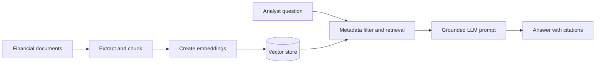
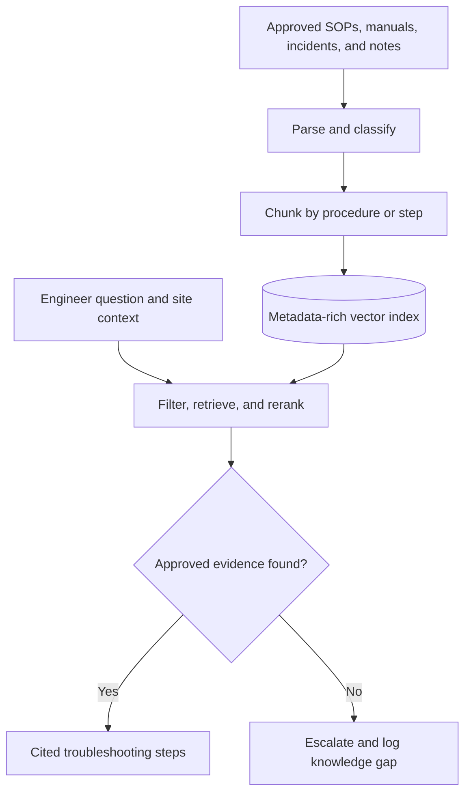
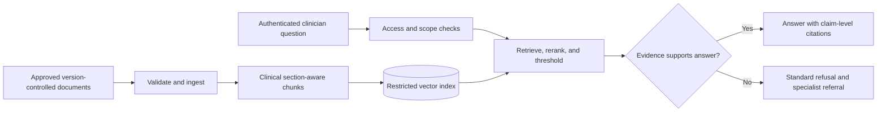

# Mini-Project: Scenario-Based Assessment

## Selecting ML, DL, GenAI, and RAG for Business Problems

This assessment explains how to formulate a problem, select an appropriate technology and model, design the solution architecture, evaluate performance, and consider business and governance implications across six finance, telecom, and healthcare scenarios.

---

## Table of Contents

1. [Executive Summary](#executive-summary)
2. [Scenario 1: Finance - Credit Default Prediction](#scenario-1--finance-credit-default-prediction)
3. [Scenario 2: Finance - Financial Document Assistant](#scenario-2--finance-financial-document-assistant)
4. [Scenario 3: Telecom - Customer Churn](#scenario-3--telecom-customer-churn)
5. [Scenario 4: Telecom - Network Operations Copilot](#scenario-4--telecom-network-operations-copilot)
6. [Scenario 5: Healthcare - Patient Readmission](#scenario-5--healthcare-patient-readmission)
7. [Scenario 6: Healthcare - Clinical Knowledge Assistant](#scenario-6--healthcare-clinical-knowledge-assistant)
8. [Univariate, Bivariate, and Multivariate Analysis](#univariate-bivariate-and-multivariate-analysis)
9. [Cross-Scenario Considerations](#cross-scenario-considerations)
10. [Conclusion](#conclusion)
11. [Glossary](#glossary)

---

## Executive Summary

Technology should be selected based on the problem, data, risk, and operational requirements rather than the popularity of a tool.

| Scenario | Problem Type | Data Type | Recommended Approach | Primary Evaluation |
|---|---|---|---|---|
| Credit default prediction | Binary classification | Structured tabular data | ML, especially gradient boosting | Recall, PR-AUC, calibration, expected cost |
| Financial document assistant | Document question answering | Unstructured text and PDFs | GenAI with RAG | Recall@k, MRR, faithfulness, answer correctness |
| Customer churn | Binary classification | Structured behavioral data | ML, with optional survival analysis | Recall, F1, PR-AUC, campaign lift |
| Network operations copilot | Knowledge-grounded question answering | Manuals, logs, SOPs, and notes | GenAI with RAG | Retrieval relevance, groundedness, resolution rate |
| Patient readmission | Binary classification | Structured clinical data | Interpretable ML | Sensitivity, PR-AUC, calibration, subgroup fairness |
| Clinical knowledge assistant | Closed-corpus question answering | Approved clinical documents | Restricted RAG | Faithfulness, refusal accuracy, clinical review |

### General Decision Guide

- **Use traditional ML** for prediction on structured tabular data when interpretability, speed, and auditability matter.
- **Use DL** for large-scale images, audio, text, or complex sequences that benefit from representation learning.
- **Use GenAI** when the required output involves understanding or generating natural language.
- **Use RAG** when GenAI answers must be based on current, private, approved, or frequently changing documents.

---

## Scenario 1 — Finance: Credit Default Prediction

**Data:** income, credit score, loan amount, employment history, previous defaults, transaction behavior, debt-to-income ratio (2M customer records, structured/tabular).

### Recommended Solution

1. **ML or DL?** ML. This is structured, tabular data with a moderate number of well-understood features — tree-based ML models handle this as well as or better than DL, train faster, and are far more interpretable (important for credit decisions, which are often regulated/auditable).
2. **Algorithms to consider:** Logistic Regression (baseline, interpretable), Random Forest, Gradient Boosting (XGBoost / LightGBM / CatBoost) — boosting typically wins on tabular credit-risk data.
3. **Target variable:** A binary flag, e.g. `defaulted` (1 = defaulted within the observation window, 0 = did not), usually defined over a fixed horizon (e.g. defaulted within 12/24 months of loan origination).
4. **Evaluation metrics to prioritize:** Recall (for the default class), Precision, F1, ROC-AUC, and Precision-Recall AUC (more informative than ROC-AUC under imbalance). Plain accuracy is de-prioritized.
5. **Why recall over accuracy?** Defaults are rare, so a model that predicts "no default" for everyone can still score >90% accuracy while catching zero actual defaulters. Missing a true defaulter (false negative) costs the bank the loan principal — a much larger loss than the cost of extra scrutiny on a false positive. Recall directly measures how many actual defaulters the model catches.
6. **Handling class imbalance:** Class-weighting / `scale_pos_weight` in the loss function, resampling (SMOTE/undersampling) on the training set only (never on validation/test), and threshold tuning on the precision-recall curve instead of using the default 0.5 cutoff.
7. **When would DL make sense?** If the bank adds high-cardinality behavioral/sequential data — e.g. raw transaction sequences, time-series spending patterns, or text from loan applications/customer notes — a DL architecture (LSTM/Transformer for sequences, embeddings for high-cardinality categoricals) could extract patterns tabular ML can't capture. Pure static tabular features alone don't justify DL.

---

## Scenario 2 — Finance: Financial Document Assistant

**Need:** Answer analyst questions (e.g. "What are the major risks mentioned in the latest annual report?") over thousands of reports/statements/policy/regulatory documents.

### Recommended Solution

1. **ML, DL, or GenAI?** GenAI — this is natural-language question answering over unstructured documents, not a prediction/classification task.
2. **RAG or fine-tuning?** RAG.
3. **Why?** The documents change constantly (new annual reports, updated regulations) — fine-tuning would need retraining every update cycle and still risks hallucinating specifics (numbers, dates) that a base/fine-tuned model was never guaranteed to memorize correctly. RAG keeps the LLM frozen and simply swaps/updates the retrievable document index, which is cheaper, faster to update, and lets answers cite the exact retrieved source passage — essential for financial answers that must be traceable and auditable.
4. **Architecture:**
   - Ingest: PDF/HTML loaders → text extraction → chunking (e.g. by section/page) → embedding model → vector store (FAISS/Pinecone/etc.), with metadata (document name, section, fiscal year, page).
   - Query time: analyst question → embed → similarity search (top-k, optionally filtered by metadata like "latest annual report") → retrieved chunks assembled into a prompt with strict "answer only from context" instructions → LLM generates the answer → response + cited source chunks returned to the analyst.
5. **Reducing hallucination:** Strict prompt instructions ("use only the provided context; say if not found"), retrieval-grounded citations forcing traceability, limiting retrieval to the correct document version via metadata filters, low temperature/deterministic generation, and a fallback "not available in the provided documents" response when retrieval similarity scores are too low.
6. **Evaluating retrieval quality:** Precision@k / Recall@k against a labeled set of (question, correct source passage) pairs, Mean Reciprocal Rank (MRR) for how high the right chunk ranks, and manual/LLM-judged relevance scoring of retrieved chunks vs. the question.

### Architecture Flow

### Additional Controls and Evaluation

- Use hybrid keyword and vector retrieval plus reranking for names, dates, and financial terminology.
- Enforce document-level access permissions at retrieval time.
- Measure answer correctness, claim-level faithfulness, citation correctness, and refusal accuracy in addition to retrieval metrics.
- Detect prompt injection in uploaded documents and exclude superseded document versions.

---

## Scenario 3 — Telecom: Customer Churn

**Data:** call duration, data consumption, complaints, recharge frequency, plan type, tenure, network quality, customer service interactions.

### Recommended Solution

1. **Type of ML problem:** Binary classification (churn vs. no churn) — typically framed with a time horizon.
2. **Target variable:** `churned_within_30_days` — binary flag indicating whether the customer left/deactivated within the next 30 days after the observation point.
3. **Models to consider:** Logistic Regression (baseline), Random Forest, Gradient Boosting (XGBoost/LightGBM) — tabular behavioral data, boosting usually performs best; survival analysis (e.g. Cox proportional hazards) is also a strong option if "time to churn" matters, not just yes/no.
4. **Evaluation metric to prioritize:** Recall / F1 / PR-AUC for the churn class (churn is typically a minority class), since the business cares more about catching at-risk customers than overall accuracy.
5. **Converting predictions into business actions:** Rank customers by predicted churn probability → route the highest-risk segment to retention campaigns (discounts, plan upgrades, proactive support outreach) → track intervention lift via a holdout/control group → feed outcomes back to retrain the model periodically.
6. **How GenAI complements the churn model:** The ML model flags *who* is at risk; GenAI can generate the *why* and the *response* — e.g. summarizing the customer's complaint history/support tickets into a human-readable risk explanation for a retention agent, or drafting personalized retention offers/messages based on the customer's specific usage pattern and complaint history.

---

## Scenario 4 — Telecom: Network Operations Copilot

**Need:** Engineer asks "Cell site XYZ has repeated packet-loss incidents — what troubleshooting steps should I follow?" over incident logs, troubleshooting manuals, SOPs, equipment docs, engineer notes.

### Recommended Solution

1. **Why RAG?** The answer must come from the company's own, frequently-updated operational knowledge (specific SOPs, equipment models, past incident resolutions) — a generic LLM has no knowledge of this proprietary content, and the answer must be grounded/traceable to an actual approved procedure rather than a plausible-sounding but invented one. RAG retrieves the exact relevant procedure instead of relying on the model's parametric memory.
2. **What to index:** Troubleshooting manuals, SOPs, equipment/vendor documentation, resolved incident logs (symptom → root cause → resolution), and structured engineer notes — chunked by procedure/section.
3. **RAG architecture:** Documents → chunk (per-procedure/per-step where possible) → embed → vector store with metadata (equipment type, issue category e.g. "packet loss", site/region if applicable, document version/date) → engineer's question embedded and matched (optionally metadata-filtered by issue category/equipment) → top-k procedure chunks retrieved → LLM prompt constrained to "generate the answer using only these retrieved steps" → structured troubleshooting-steps answer with the source SOP/manual cited.
4. **Preventing invented procedures:** Prompt explicitly forbids generating steps not present in retrieved context, requires citing the source document/section for every step, uses a low/zero temperature, and falls back to "no matching procedure found — escalate to a senior engineer" rather than filling gaps.
5. **Metadata that improves retrieval:** Equipment/vendor model, issue/symptom category (e.g. "packet loss", "latency"), site or region, document type (SOP vs. incident log vs. manual), and document version/last-updated date (to prefer the current SOP over a superseded one).
6. **If the relevant procedure doesn't exist in the knowledge base:** The system should return an explicit "no matching troubleshooting procedure found in the knowledge base" instead of guessing, and route the engineer to escalate to a human specialist or log it as a knowledge-base gap for the SOP team to fill.

### Architecture Flow

### Operational Safeguards

- Prefer approved SOPs over informal notes and include approval status in metadata.
- Require human confirmation before any network-changing command is executed.
- Evaluate citation accuracy, correct-version use, expert-rated safety, and mean time to resolution.
- Treat low-confidence, conflicting, or expired evidence as a no-answer condition.

---

## Scenario 5 — Healthcare: Patient Readmission

**Data:** age, diagnosis, length of stay, previous admissions, medication count, lab results, comorbidities.

### Recommended Solution

1. **ML or DL?** ML — tabular clinical data with a modest number of interpretable features; ML (especially interpretable models) is preferred in healthcare because clinicians need to understand and trust the reasoning behind a risk score.
2. **Target variable:** `readmitted_within_30_days` (binary: 1 = readmitted to the hospital within 30 days of discharge, 0 = not).
3. **Evaluation metrics:** Recall/Sensitivity (catch as many true readmissions as possible), Precision, F1, ROC-AUC and PR-AUC, and calibration (predicted probabilities should reflect true risk, since clinicians act on the probability, not just the label).
4. **Why false negatives matter:** A false negative means a patient who will actually be readmitted is predicted as low-risk and doesn't receive extra discharge planning/follow-up care — a missed intervention that can directly harm patient health and increase costs, which is more dangerous than a false positive (which just means some extra, low-risk follow-up for a patient who didn't need it).
5. **Explaining predictions to clinicians:** Use inherently interpretable models (logistic regression, decision trees) or explainability tools (SHAP/LIME feature-attribution) on top of a more complex model, presenting the top contributing factors per patient (e.g. "high medication count + prior admissions + long length of stay drove this risk score") rather than a black-box number alone.
6. **Risks before deployment:** Bias/fairness across demographic groups (age, race, socioeconomic proxies), data drift as clinical practices change, over-reliance on the model overriding clinical judgment, regulatory/compliance requirements (e.g. clinical validation, FDA/medical-device-adjacent scrutiny), and the consequences of false negatives/positives on patient care and hospital resourcing.

---

## Scenario 6 — Healthcare: Clinical Knowledge Assistant

**Constraint:** "The assistant must not answer using information outside our approved documents" — clinical guidelines, hospital SOPs, treatment protocols, policy documents, procedure manuals.

### Recommended Solution

1. **Architecture:** Approved documents → chunking → embedding → vector store restricted to only these approved sources → clinician question → retrieval (top-k, similarity-thresholded) → strictly-grounded prompt → LLM answer with citations to the specific guideline/SOP → answer + source references returned to the clinician.
2. **Why RAG is appropriate?** RAG grounds every answer in a specific, retrievable, approved document instead of the LLM's general training data, which is exactly what "must not answer using information outside our approved documents" requires — and it makes every answer auditable back to a specific guideline/protocol, critical for clinical/regulatory accountability.
3. **Retrieval pipeline:** Approved-document ingestion only (no external or unapproved sources are ever indexed) → chunk by clinical section/protocol step → embed → vector similarity search restricted to this closed corpus → optional metadata filters (document type, specialty, last-review date) → top-k chunks passed as the only allowed context to the LLM.
4. **No answer exists in the knowledge base:** Return an explicit "This information is not available in our approved documents — please consult a specialist or the relevant department" rather than generating an answer from general knowledge; this is enforced directly in the prompt instructions and via a similarity-score threshold below which retrieval is treated as "no match."
5. **Evaluating hallucination:** Manually or programmatically check whether every claim in the generated answer can be traced back to the retrieved context (claim-level attribution/faithfulness scoring), run a test set of known in-scope and deliberately out-of-scope questions and confirm out-of-scope ones trigger the "not available" response, and use an LLM-as-judge or human clinical reviewer to flag any unsupported statements.
6. **Safeguards:** Context-only prompting with an explicit refusal instruction, similarity-score thresholding before allowing an answer, mandatory source citation on every answer, human clinical review/sign-off before the assistant is trusted for high-stakes guidance, audit logging of all Q&A pairs, and restricting the indexed corpus to only officially approved/version-controlled documents (with old versions removed on update).
7. **Would you fine-tune the LLM?** No, not as the primary approach. Fine-tuning bakes knowledge into model weights, which doesn't guarantee faithful recall of exact clinical wording (models can still misremember/blend facts), can't be easily audited back to a source document, and requires expensive retraining every time a guideline is updated. RAG keeps the model frozen and the knowledge base independently updatable/auditable, which better satisfies the "only approved documents" and traceability requirements. Fine-tuning could still be used narrowly to teach the model a desired *response style/format* (e.g. structured answer with citations), but not to teach it clinical facts.

### Architecture Flow

> **Important limitation:** RAG improves grounding but does not mathematically guarantee that a general-purpose LLM will ignore all pretrained knowledge. This constraint must also be enforced through restricted inputs, output validation, refusal testing, clinical review, and audit controls.

---

## Univariate, Bivariate, and Multivariate Analysis

Using an Employee dataset (`ID | Age | Salary | Experience`) as an example:

- **Univariate analysis** — examining one variable alone. E.g. "Which employee has the highest salary?" or the distribution of `Salary` on its own (histogram, mean, median, spread).
- **Bivariate analysis** — examining the relationship between two variables. E.g. "How does Salary vary with Experience?" (scatter plot of Salary vs. Experience, correlation coefficient).
- **Multivariate analysis** — examining the relationship among three or more variables together. E.g. "How does Salary vary with Experience *and* Age combined?" (e.g. a multiple regression of Salary on both Experience and Age, or a 3D/colored scatter plot).

This same pattern applies to the Insurance dataset in this project: `charges` alone is univariate, `charges` vs. `age` is bivariate, and `charges` vs. `age` and `smoker` and `bmi` together is multivariate.

### Quick Comparison

| Analysis Type | Variables | Main Purpose | Example |
|---|---:|---|---|
| Univariate | One | Describe one feature's distribution and summary statistics | Distribution of `Salary` |
| Bivariate | Two | Examine an association between two features | `Salary` versus `Experience` |
| Multivariate | Three or more | Study joint relationships while accounting for multiple features | `Salary` using `Experience` and `Age` |

> **Interpretation note:** Correlation and feature attribution do not establish causation. Data quality, confounding variables, sampling bias, and domain context must be considered before drawing conclusions.

---

## Cross-Scenario Considerations

### Data Quality

Define labels consistently, handle missing values and duplicates, validate source systems, and prevent leakage from future information. Training, validation, and test data should represent the intended production population and time period.

### Privacy, Security, and Access

Apply data minimization, encryption, role-based access, retention controls, and audit logging. Financial, customer, and health information should not be sent to an external model provider without appropriate contractual and technical safeguards.

### Fairness and Human Oversight

Measure performance across relevant subgroups, investigate harmful disparities, and retain human review for high-impact decisions. Explanations should assist professional judgment and should not present association as causation.

### Production Monitoring

Monitor input drift, output drift, model performance, probability calibration, latency, cost, retrieval quality, citation accuracy, and refusal behavior. Each solution needs named owners, alert thresholds, retraining or re-indexing schedules, and rollback procedures.

### Business Value

Technical metrics should connect to measurable outcomes such as reduced credit loss, improved retention, lower mean time to resolution, fewer avoidable readmissions, analyst time saved, and safer access to approved knowledge. Controlled pilots should verify real-world value before broad deployment.

---

## Conclusion

The three prediction scenarios use structured data and are best approached with interpretable ML models, particularly logistic regression and gradient-boosted trees. DL becomes valuable when sufficiently large and complex unstructured or sequential data is introduced.

The document-assistant scenarios require GenAI with RAG because answers must use private, current, and traceable information. A reliable RAG system requires controlled ingestion, strong retrieval, metadata, evidence thresholds, citations, refusal behavior, access control, evaluation, and ongoing monitoring.

Across all six scenarios, success depends on clear problem formulation, leakage-free data, metrics aligned with business costs, human oversight, and post-deployment monitoring rather than model accuracy alone.

---

## Glossary

| Term | Meaning |
|---|---|
| ML | Machine Learning |
| DL | Deep Learning |
| GenAI | Generative Artificial Intelligence |
| RAG | Retrieval-Augmented Generation |
| LLM | Large Language Model |
| SOP | Standard Operating Procedure |
| PR-AUC | Area under the Precision-Recall Curve |
| ROC-AUC | Area under the Receiver Operating Characteristic Curve |
| MRR | Mean Reciprocal Rank |
| SHAP | SHapley Additive Explanations |
| Data leakage | Use of information during training that would not be available at prediction time |
| Calibration | Agreement between predicted probabilities and observed outcome rates |
| Faithfulness | Degree to which a generated answer is supported by supplied evidence |
